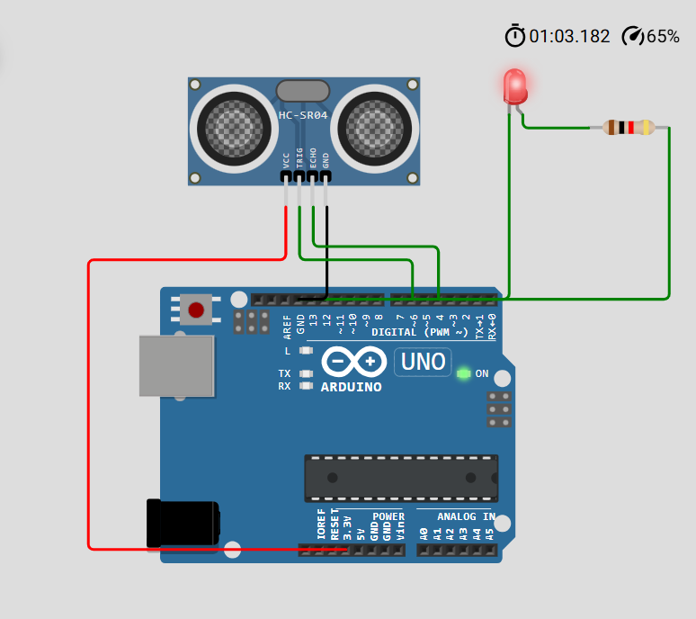

# Arduino Based LED Blinking Using Ultrasonic Sensor

## 📌 Project Overview

This project uses an ultrasonic sensor to detect distance and control an LED. The LED blinking speed changes based on how close or far an object is.

## ⚙️ Components Used

* Arduino UNO
* Ultrasonic Sensor (HC-SR04)
* LED
* Resistor (220Ω)
* Breadboard & Jumper wires

## 🔌 Circuit Diagram

## 💡 Working Principle

* Ultrasonic sensor sends sound waves
* Echo returns after hitting object
* Distance is calculated using time
* LED blinks faster when object is near

## 💻 Code

## 📊 Output

* Object near → Fast blinking LED
* Object far → Slow blinking LED

## 🚀 Future Improvements

* Add buzzer alert
* Use OLED display for distance
* Convert to IoT project

## 👩‍💻 Author

Revati Shimpukade

